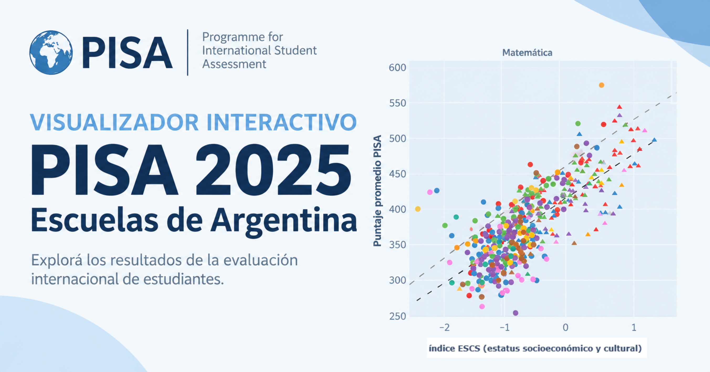

# PISA 2025 Argentina: desempeño por escuela vs. nivel socioeconómico

Visualizador interactivo: cada punto es una escuela argentina en PISA 2025, con su puntaje promedio (Y) y su índice socioeconómico y cultural promedio, ESCS (X), en Matemática, Lectura y Ciencias.

🌐 **Página hosteada:** https://rquiroga7.github.io/PISA_2025_ARG/

## Uso

- **Región**: muestra/oculta cada grupo geográfico (CABA, Buenos Aires, Córdoba, Santa Fe, Mendoza, NOA, NEA, Cuyo, Patagonia).
- **Gestión**: muestra/oculta escuelas públicas (●) y privadas (▲) por separado.
- **Ajuste**: tendencias MCO por escuela de Argentina, Latinoamérica y OCDE.
- Pasá el cursor sobre un punto para ver el detalle de la escuela.

## Metodología (breve)

- Fuente: microdatos PISA 2025 de la OCDE (Argentina: 11.092 estudiantes / 412 escuelas).
- Cada escuela: promedio ponderado por estudiante (`W_FSTUWT`); el puntaje promedia los 10 valores plausibles. Se grafican 405 escuelas (7 excluidas por ESCS faltante).
- Color = grupo geográfico del estrato muestral; símbolo = gestión declarada por la dirección (en 60 escuelas sin respuesta se imputa desde el estrato).
- Tendencias: MCO sin ponderar por escuela (Argentina: 405 escuelas; Latinoamérica: 3.936 escuelas de 11 países; OCDE: 10.594 escuelas de 35 países).
